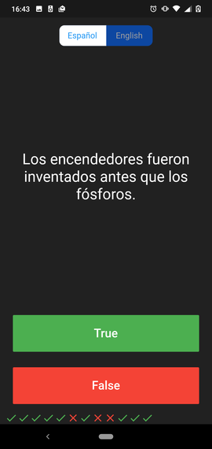

# Quizzler ❓

This project is part of a series of projects to be completed by students of the [AppBrewery](https://www.appbrewery.co/p/flutter-development-bootcamp-with-dart) flutter course.

This project focuses on creating a Quizz app.

## Preview

## 🧮 The Project Brief

The premise of this project is to learn how to build several classes to have a better code structure using OOP principles like Polymorphism, Abstraction, Encapsulation and Inheritance, by building a Question True/False UI.

## 🎯 Features

* You can switch between English and Spanish by touching the toggle button

#### English

#### Spanish 

* You can see if your answers where right or wrong with a live update at the bottom of the screen

#### Right or Wrong?

* You get the number of correct answers at the end of the game 

#### Results

## 🧬 Technologies & Languages Used

- Dart
- Flutter
- Github

## 🛎️ Contributions, Issues & Forking

If you have any issues setting up the project or you come across any unintended bugs or problems, please do submit an issue to the [Quizz app](https://github.com/Psiale/quizzler-flutter/issues) page.

If you want to make your own changes, modifications or improvements to our project, go ahead and Fork it!
1. [Fork it](https://github.com/Psiale/quizzler-flutter/fork)

2. Create your working branch (git checkout -b [choose-a-name])

3. Commit your changes (git commit -m 'what this commit will fix/add/improve')
4. Push to the branch (git push origin [chosen-name])
5. Create a new Pull Request

## 🤟🏽😄 😛🤙🏾  Creator

Alexis Sanchez 
- [Github](https://github.com/Psiale)
- [Linkedin](https://www.linkedin.com/in/alexis-sanchez-dev/)

## 🙌🏾 Show Your Support

Give a ⭐️ if you like this project!

